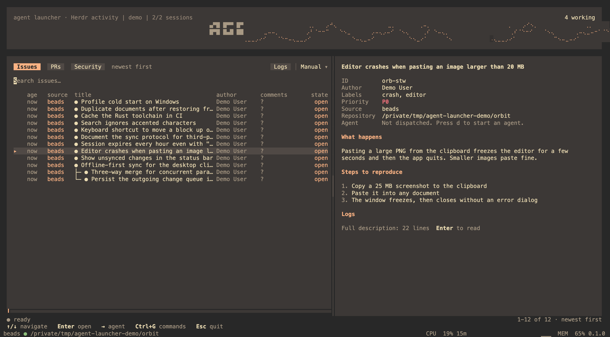
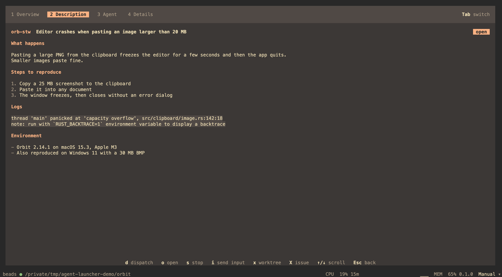
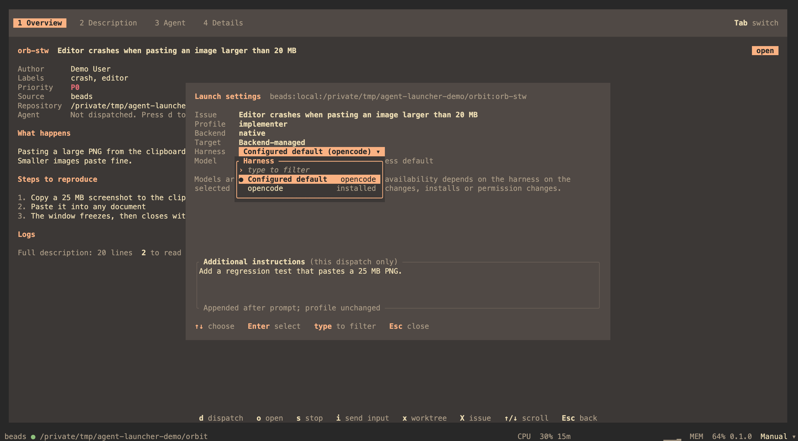

<h1 align="center">agent-launcher</h1>

<p align="center">
  <a href="https://github.com/penso/agent-launcher/actions/workflows/ci.yml"></a>
</p>

<p align="center">
  <a href="https://github.com/penso/agent-launcher/releases">Releases</a> ·
  <a href="docs/inbox.md">The inbox</a> ·
  <a href="docs/dispatch.md">Dispatching agents</a> ·
  <a href="docs/away-mode.md">Away mode</a> ·
  <a href="docs/security.md">Security reviews</a> ·
  <a href="docs/herdr-activity.md">Herdr activity</a> ·
  <a href="config.example.toml">Configuration</a>
</p>

A terminal inbox for one repository's issues and pull requests that sends coding agents to work
on them, each in its own worktree. Run it inside a Git repository: it reads the GitHub or GitLab
remote, and [Beads](https://github.com/steveyegge/beads) issues when `.beads` exists.

<p align="center">
  
  <br>
  <sub><b>List and preview.</b> On wide terminals the selected row's Overview sits beside the
  list. Drag the divider to resize the two, or to close the preview.</sub>
</p>

<table>
  <tr>
    <td width="50%" valign="top">
      
      <br>
      <sub><b><a href="docs/inbox.md">Details in tabs</a>.</b> Overview, the Markdown
      description, the agent's run and log, and the technical details.</sub>
    </td>
    <td width="50%" valign="top">
      
      <br>
      <sub><b><a href="docs/dispatch.md">Launch settings</a>.</b> Pick a prompt profile, then a
      harness and model from what is installed, and add instructions for this run only.</sub>
    </td>
  </tr>
</table>

Agents run in [Herdr](https://github.com/herdrdev/herdr), a local OpenCode server, Superset or
Conductor. `→` jumps to an item's agent. [Away mode](docs/away-mode.md) works through a
prioritized queue on its own, and the [Security tab](docs/security.md) reviews private GitHub
advisories after explicit consent.

## Install

With [Homebrew](https://brew.sh/), on macOS (Apple Silicon or Intel) or Linux:

```sh
brew install penso/tap/agent-launcher
```

Or download a tarball from [Releases](https://github.com/penso/agent-launcher/releases) and put
`bin/agent-launcher` on your `PATH`. To build from source, with the Rust toolchain pinned in
`rust-toolchain.toml`:

```sh
git clone https://github.com/penso/agent-launcher
cd agent-launcher
just install   # builds a release binary into ~/.local/bin/agent-launcher
```

The backends you use need their CLIs: `gh`, `bd`, `herdr`, `opencode` or `superset`.

## Usage

```sh
cd ~/code/your-repository
agent-launcher
agent-launcher --remote git@gitlab.com:group/repository.git   # another repository's inbox
agent-launcher --layout fixed                                 # the centered 104-column inbox
```

`--remote` only changes which issues are listed; agents still work in the repository you launched
from. Settings live in `~/.config/agent-launcher/config.toml`; see
[`config.example.toml`](config.example.toml).

Credentials come from the environment or each tool's own login:

- GitHub: `GH_TOKEN`, then `GITHUB_TOKEN`, then `gh auth`
- GitLab: `PRIVATE_TOKEN`, then `GITLAB_TOKEN`
- Conductor: `CONDUCTOR_API_TOKEN`, then `CONDUCTOR_API_KEY`
- Superset, Herdr, OpenCode, SSH, Daytona, Coder and Azure use their own CLI login

## Keys

| Key | Inbox | Detail |
| --- | --- | --- |
| `↑` / `↓` | Navigate | Scroll |
| Type / Backspace | Filter | |
| `Tab` / `Shift+Tab` | Switch Issues / PRs | Switch Overview / Description / Agent / Details |
| `1`–`4` | | Jump to a tab |
| `Enter` | Open | |
| `→` | Go to the item's agent | Same |
| `d` | | Dispatch issue / review PR |
| `Ctrl+G`, then `d` / `r` / `s` / `g` | Dispatch, refresh, sort, debug | |
| `r` / `i` / `o` / `s` | | Refresh / send input / open workspace / stop run |
| `x` / `X` | | Delete worktree / delete source issue (Beads only) |
| `Esc` | Quit | Back to the inbox |

Rows, tabs and the divider take the mouse too; see [The inbox](docs/inbox.md).

## Development

```sh
just run
just format-check
just lint
just test
just demo-shots   # screenshots of a seeded Beads demo, in target/demo/
```

`just demo-shots` seeds realistic Beads issues under `/tmp/agent-launcher-demo` and drives the
launcher in a private tmux server with a throwaway `HOME`, so your state, config and Herdr
session are never touched. With Google Chrome installed it also renders the PNGs above.

## License

[Apache-2.0](LICENSE) © 2026 Fabien Penso.
